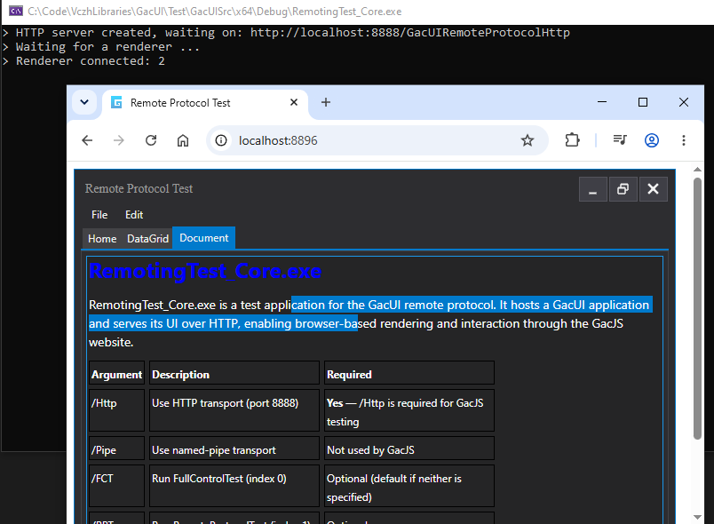
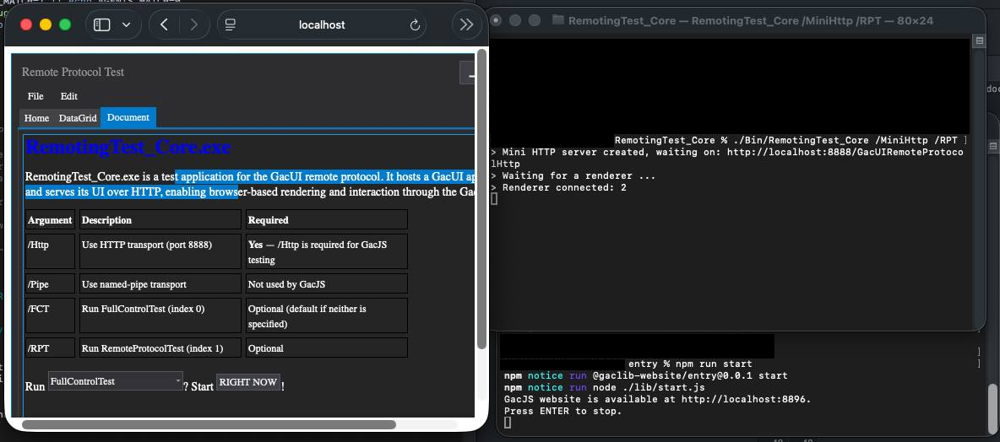
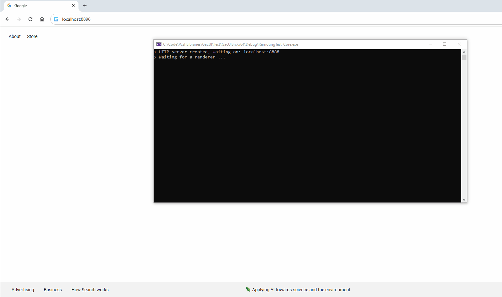
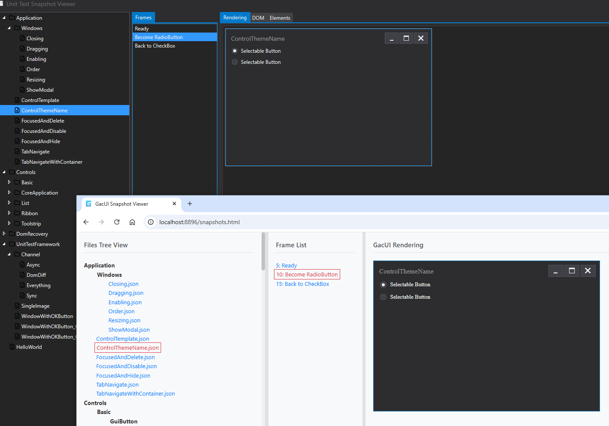

# GacJS

**Read the [LICENSE](https://github.com/vczh-libraries/GacJS/blob/master/LICENSE.md) first.**

[](https://deepwiki.com/vczh-libraries/GacJS)

Running GacUI in Browsers!

## Building this Project

The root of test projects is in the `Gaclib` folder,
`yarn build` and you will get all files created to `Gaclib\website\entry\lib\dist`.

## Run in Browser

Run [RemotingTest_Core.vcxproj](https://github.com/vczh-libraries/GacUI/tree/master/Test/GacUISrc/RemotingTest_Core)
with `/Http` on Windows or `/MiniHttp` on Windows, Linux, or macOS.

Start the website on port `8896`:

```bash
cd Gaclib\website\entry
npm run start
```

Open `http://localhost:8896` and press ENTER in the server terminal when you want to stop it. This is an interactive GacUI renderer.




### Interacting with GacUI Core


### Switching between Renderers

You can start a local `RemotingTest_Win32_Renderer` with `/Http` or `/Pipe`, do something to the UI, and start the website, you can see the website take over the running UI on the fly.



## localhost/snapshots.html

A demo for rendering [GacUI Unit Test with Snapshots](https://github.com/vczh-libraries/GacUI/tree/master/Test/GacUISrc/UnitTestViewer)


