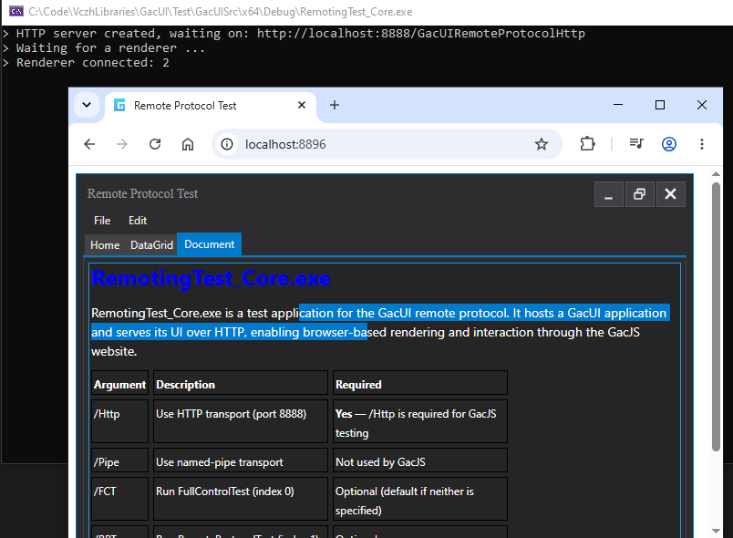
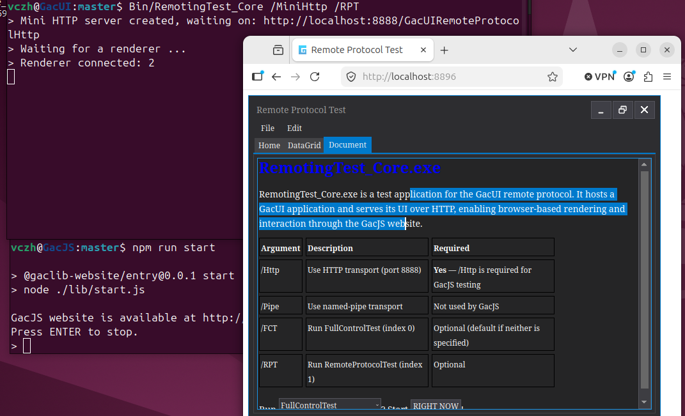
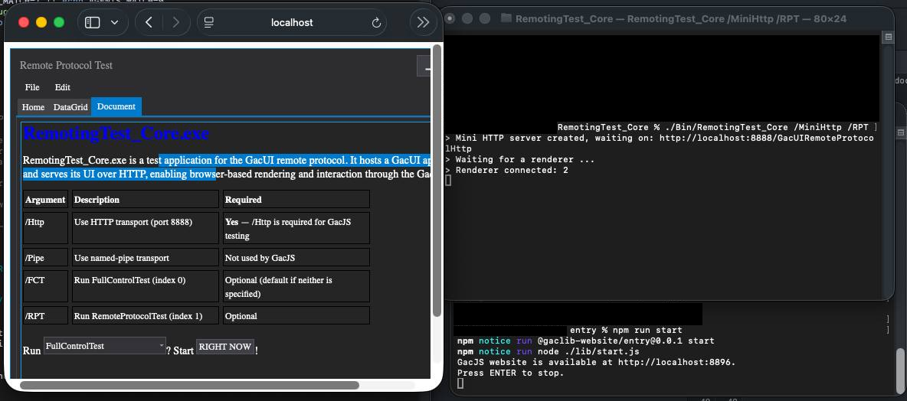
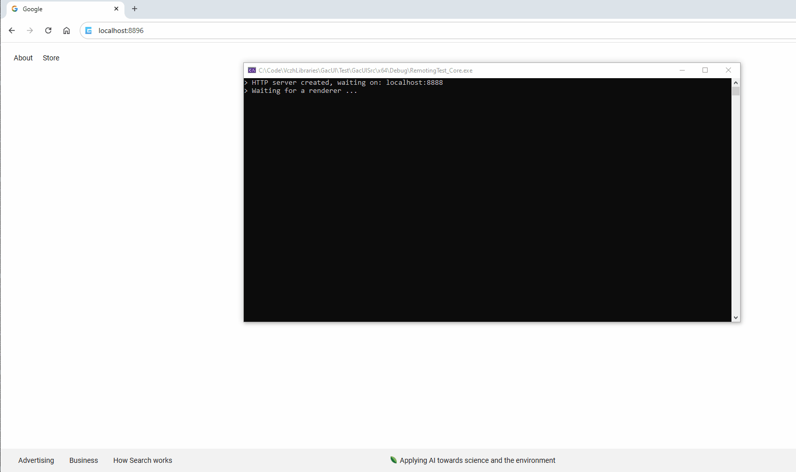
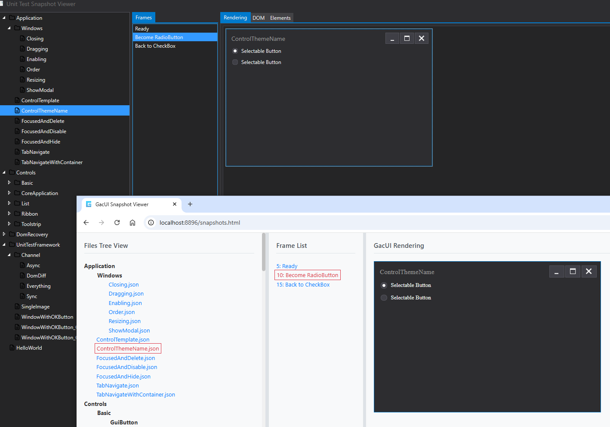

# GacJS

**Read the [LICENSE](https://github.com/vczh-libraries/GacJS/blob/master/LICENSE.md) first.**

Running GacUI in browsers with WebAssembly is GacJS's primary purpose and most important feature. The current demos load the GacUI C++ core as a `.wasm` file in a browser worker, render its UI with HTML5, and can implement its view model in TypeScript.

Both the HTML5 renderer and the TypeScript view-model host connect to the core through exposed WebAssembly functions and callbacks. This reuses GacUI Remote Protocol for rendering and Workflow RPC for view models. WebAssembly and HTTP are alternative transports for those channels; HTTP support primarily makes it possible to test HTML5 rendering without building WebAssembly.

## Documentation

| Area | Document |
|---|---|
| Architecture | [Project Structure](doc/Projects.md) |
| WebAssembly demos | [Running the Wasm Demos on Linux](doc/Projects.md#running-the-wasm-demos-on-linux) |
| Network transport and handshakes | [GacJS Network Protocol](doc/NetworkProtocol.md) |
| Remote Protocol | [GacUI Remote Protocol Reference](doc/Protocol.md) |
| Rendering | [GacUI HTML DOM Rendering](doc/DOM.md) |
| Rich text | [DocumentParagraph Implementation](doc/DocumentParagraph.md) |
| E2E testing | [Testing the Remote Protocol with Playwright](doc/Testing_Protocol.md) |
| Snapshot testing | [Testing with Snapshots](doc/Testing_Snapshot.md) |
| Workflow RPC | [Workflow Interface-Based RPC](doc/rpc/Features.md) |
| Workflow RPC lifetime | [Memory Management for Workflow RPC in TypeScript](doc/rpc/MemoryManagement.md) |
| Workflow RPC bindings | [Generating TypeScript Bindings for Workflow RPC](doc/rpc/CodeGeneration.md) |

## Building this Project

The root of test projects is in the `Gaclib` folder,
`yarn build` and you will get all files created to `Gaclib\website\entry\lib\dist`.

## Run in Browser

### WebAssembly

The existing demos run the core inside the browser. To prepare them on Linux:

1. Build `WasmFCT`, `WasmRPT`, and `WasmRVMT` in the sibling GacUI checkout. From each `GacUI/Test/Linux/<project>` directory, run `../../../.github/Ubuntu/build.sh -bw -o`.
2. Build GacJS with `yarn build` from `Gaclib`.
3. From `Gaclib`, run `../copy-wasm.sh` to copy each demo's matching `app.mjs`, `app.wasm` and `app.worker.js` into the website. Repeat this after every website build because that build cleans the output directory.

See [the WebAssembly build guide](doc/Projects.md#running-the-wasm-demos-on-linux) for details. The website build does not compile or copy the WebAssembly binaries automatically.

From `Gaclib/website/entry`, start the website on port `8896`:

```sh
npm run start
```

Open one of these pages:

| Page | Demo |
|---|---|
| [FullControlTest](http://localhost:8896/wasm-fct/) | Control showcase |
| [RemoteProtocolTest](http://localhost:8896/wasm-rpt/) | Remote rendering features |
| [RemoteViewModelTest](http://localhost:8896/wasm-rvmt/) | HTML5 rendering and a TypeScript view model connected to the WebAssembly core |

The website server supplies the module files and shared-memory headers; application traffic uses WebAssembly functions through the worker, without a separate HTTP core process. Press ENTER in the server terminal when you want to stop serving the website.

### HTTP testing

For testing the same HTML5 renderer against a native core, run [RemotingTest_Core](https://github.com/vczh-libraries/GacUI/tree/master/Test/GacUISrc/RemotingTest_Core) with `/Http` on Windows or `/MiniHttp` on Windows, Linux, or macOS. Start the website as above and open [the HTTP renderer](http://localhost:8896/).

For a TypeScript view model over HTTP, run Core with `/RVMT /Http` or `/RVMT /MiniHttp` and open [the renderer with a TypeScript host](http://localhost:8896/index.html?rvmhost), without starting a separate view-model host.





### Interacting with GacUI Core


### Switching between Renderers

You can start a local `RemotingTest_Win32_Renderer` with `/Http`, do something to the UI, and start the website, you can see the website take over the running UI on the fly.



## localhost/snapshots.html

A demo for rendering [GacUI Unit Test with Snapshots](https://github.com/vczh-libraries/GacUI/tree/master/Test/GacUISrc/UnitTestViewer)


