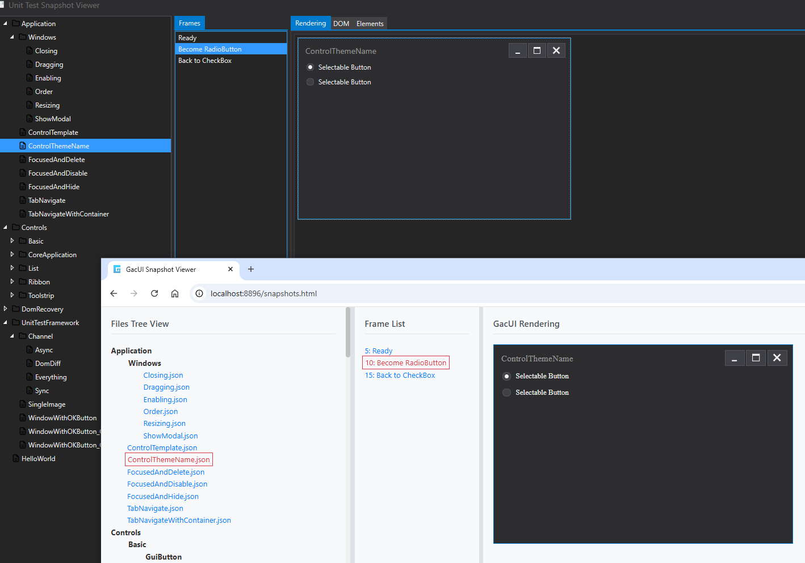

# GacJS

**Read the [LICENSE](https://github.com/vczh-libraries/GacJS/blob/master/LICENSE.md) first.**

Running GacUI in Browsers!

## Building this Project

The root of test projects is in the `Gaclib` folder,
`yarn build` and you will get all files created to `Gaclib\website\entry\lib\dist`.

Start a website from there and you can enjoy the demo!

## localhost/

This is an interactive GacUI renderer.
Run [RemotingTest_Core.vcxproj](https://github.com/vczh-libraries/GacUI/tree/master/Test/GacUISrc/RemotingTest_Core) with `/Http` and open this page.

Window management and IO interaction awaits, but as least it runs!
You can start a local `RemotingTest_Win32_Renderer` with `/Http`, do something to the UI, and start the website, you can see the website take over the running UI on the fly.

### If you open the website right away

### If you open the website after a living Win32 renderer

## localhost/snapshots.html

